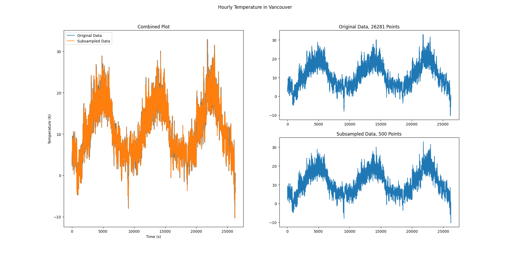

# DataSubsampler
Subsampling is the act of representing a larger dataset 
with a smaller one. It offers the primary benefits of 
faster processing and plotting.

This library currently only contains the minmax subsampling
method, which groups points together into a minimum and maximum
value. A result of this can be seen in the image below:

